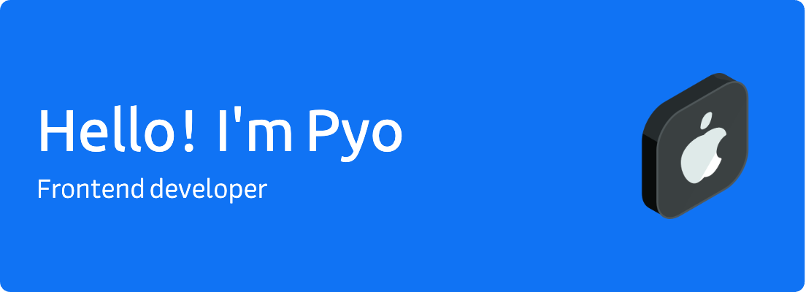

 

## About me

I have been working as a frontend developer for about 3 years in South Korea 🇰🇷

- 💬 &nbsp; Ask me about anything [here](https://github.com/hspyo/hspyo/issues)
- 📮 &nbsp; Email  olok95@gmail.com

 

## Skills

<!-- TODO: ### 🚧 **Project:** -->
<!-- TODO: ### 🚧 **Article:** -->
<!-- - 📖 &nbsp; My Blog [here](https://hsp0418.tistory.com/) -->